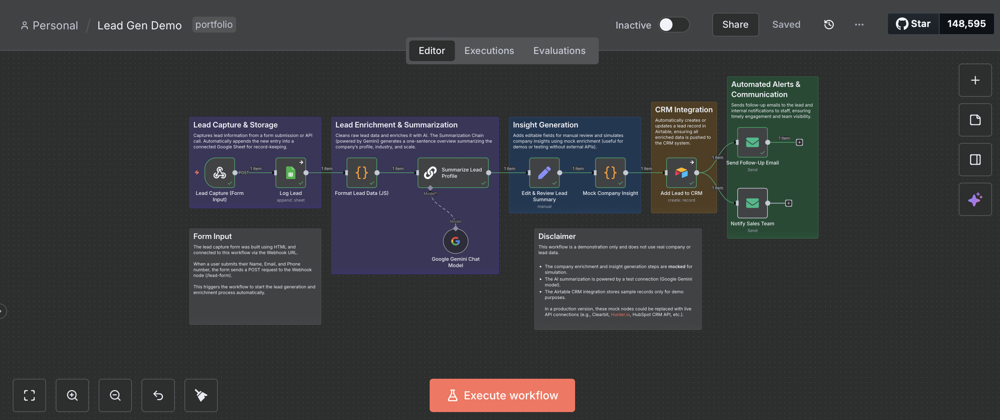

# lead-gen-n8n
# Lead Generation Automation (n8n Demo)

This project is a **portfolio demo** showing how to build a simple **lead generation workflow** using [n8n](https://n8n.io/).

The workflow captures leads from an HTML form, enriches their data (mocked for demo), generates AI summaries, and sends the results to Airtable for CRM tracking.

---

## Features

- **Lead Capture (Webhook)** — Collects data (Name, Email, Phone) from a custom HTML form.  
- **Data Formatting** — Cleans and structures incoming data using JavaScript.  
- **AI Summary (Summarization Chain)** — Creates short summaries about the lead using Gemini.  
- **Mock Enrichment** — Adds fake company insights for demo purposes.  
- **CRM Integration (Airtable)** — Saves enriched leads to Airtable.  
- **Follow-up Automation** — Sends a follow-up email to the lead.
- **Internal Notification** - Notify sales team of a new lead.
- **Error Handling** — Sends an email to the staff instantly when error occurs.

---

## How to Use

1. Clone or download this repository.  
2. Import `Lead Gen Demo.json` into your own [n8n Cloud](https://app.n8n.cloud) or [n8n Desktop](https://docs.n8n.io/hosting/installation/) instance.  
3. Open your HTML form and submit test data to trigger the workflow. To submit test data, open the Lead Capture node, click "Listen for test event", and submit the HTML form.

---

## Future Possible Improvements

- Integrate **real API enrichment** (e.g., Clearbit or People Data Labs).  
- Add **email validation** and spam detection.  
- Use **AI web scraping** (Browserless or ScrapingBee) to pull extra info about the company.  

---

## Author

**Sandy Vienne Cabunoc**  
AI Automation Enthusiast

📧 cabunocsv@gmail.com

---

### Example Workflow Screenshot 

